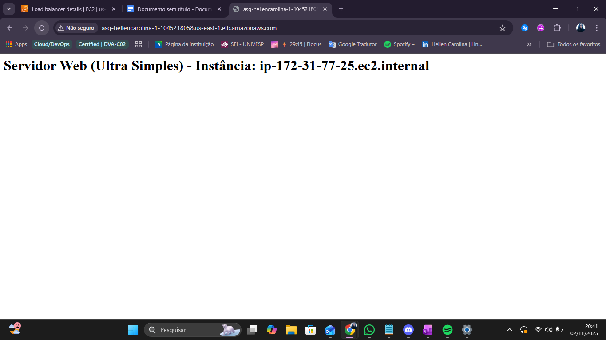
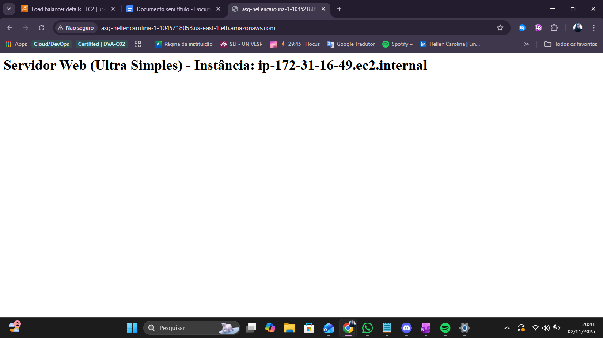

## 🛠️ Laboratório: Ambiente Web Altamente Disponível e Escalável (AWS)

**Trilha:** Solutions Architect | **Instituição:** Escola da Nuvem

### 🎯 Objetivo do Projeto

Implementar uma arquitetura web resiliente e escalável na Amazon Web Services (AWS) para garantir Alta Disponibilidade e o tratamento automático de variações de tráfego.

**Arquitetura Implementada:** Application Load Balancer (ALB) + Auto Scaling Group (ASG) + Launch Template (LT).

### ⚙️ Serviços AWS Utilizados

| Serviço | Função na Arquitetura |
| :--- | :--- |
| **EC2** | Máquinas virtuais (servidores web). |
| **VPC** | Ambiente de rede privado (usado a VPC Padrão). |
| **Application Load Balancer (ALB)** | Distribui o tráfego de entrada para os servidores. |
| **Auto Scaling Group (ASG)** | Gerencia e mantém o número desejado de instâncias (mínimo de 2). |
| **Launch Template (LT)** | O "molde" com as configurações de cada servidor (AMI, User Data, Security Group). |
| **Security Groups** | Firewalls de rede para controlar o acesso (HTTP/80, HTTPS/443). |

-----

### 📋 Pré-Requisitos

1.  Conta AWS Ativa (com permissões necessárias: `AmazonEC2FullAccess`, `AmazonEC2AutoScalingFullAccess`, `ElasticLoadBalancingFullAccess`).
2.  Região de Trabalho: **Norte da Virgínia (us-east-1)**.

### 👣 Passo a Passo da Implementação

As etapas a seguir foram realizadas no Console da AWS:

#### 1\. Verificação da Rede (VPC)

  * Confirmação do uso da **VPC Padrão** e anotação dos IDs de **duas Subnets Públicas** em Zonas de Disponibilidade (AZs) distintas.
  * Garantia de que a tabela de rotas contém uma rota para o Internet Gateway (`igw-xxxx`).

#### 2\. Criação do Security Group (SG)

Um grupo de segurança (`SG-Lab-SeuNome`) foi criado para atuar como firewall das instâncias EC2, permitindo:

| Tipo | Porta | Origem |
| :--- | :--- | :--- |
| **HTTP** | 80 | 0.0.0.0/0 (Qualquer IP) |
| **HTTPS** | 443 | 0.0.0.0/0 (Opcional, boa prática) |

#### 3\. Criação do Launch Template (LT)

O modelo (`LaunchTemplates_NomeSobrenome`) define o padrão do servidor:

  * **AMI:** Amazon Linux 2.
  * **Tipo de Instância:** `t2.micro`.
  * **Networking:** Associado ao Security Group criado (`SG-Lab-SeuNome`).
  * **User Data (Script de Inicialização):**
    O script foi configurado para instalar o servidor web Apache (`httpd`) e criar uma página HTML simples que exibe o nome da instância, essencial para o teste:

<!-- end list -->

```bash
#!/bin/bash
yum update -y
yum install -y httpd
systemctl start httpd
systemctl enable httpd
echo "<h1>Servidor Web - Instância: $(hostname -f)</h1>" > /var/www/html/index.html
```

#### 4\. Criação do Application Load Balancer (ALB) e Target Group (TG)

O ALB e seu grupo de destino foram criados de forma integrada ao ASG:

  * **Tipo de Load Balancer:** Application Load Balancer.
  * **Esquema:** `Internet-facing` (Acessível publicamente).
  * **Target Group (TG):** Criado para encaminhar o tráfego da porta 80.
  * **Health Check:** Habilitado no ALB para monitorar a saúde das instâncias.

#### 5\. Criação do Auto Scaling Group (ASG)

O ASG (`ASG-SeuNomeSobrenome`) orquestra o ambiente:

  * **Template:** Conectado ao Launch Template criado na etapa 3.
  * **Rede:** Seleção das **duas Subnets Públicas** (garantindo Alta Disponibilidade em diferentes AZs).
  * **Balanceamento de Carga:** Anexado ao novo Application Load Balancer.
  * **Capacidade:**
      * **Desejada:** 2
      * **Mínima:** 2
      * **Máxima:** 2
  * **Ação do ASG:** Automaticamente, o ASG provisionou 2 instâncias EC2 com as configurações do LT e as registrou no Target Group do ALB.

-----

### ✅ Demonstração e Teste

1.  **Acesso:** O DNS Name do Load Balancer foi copiado e acessado no navegador.
2.  **Resultado Esperado:** A página do servidor web foi exibida, mostrando o nome da primeira instância (Ex: "Servidor Web - Instância: ip-xxx-xxx-xxx-xxx").
3.  **Teste de Balanceamento:** Ao atualizar a página, o ALB roteou a requisição para a segunda instância, exibindo o novo nome (Ex: "Servidor Web - Instância: ip-yyy-yyy-yyy-yyy").

**Conclusão do Teste:** O ambiente está configurado com sucesso para distribuir o tráfego e é resiliente a falhas de instância, pois o ASG manterá a capacidade de 2 servidores sempre que houver falhas.

-----

### 🗑️ Limpeza de Recursos

Para evitar cobranças, todos os recursos foram excluídos na ordem correta:

1.  Excluir o **Auto Scaling Group** (para encerrar as instâncias EC2).
2.  Excluir o **Application Load Balancer** e o **Target Group**.
3.  Excluir o **Launch Template**.
4.  Excluir o **Security Group**.

-----
### 📊 Imagens do Laboratório:

<div style="display: flex; flex-wrap: wrap; gap: 10px; justify-content: center;">
    
    
</div>
